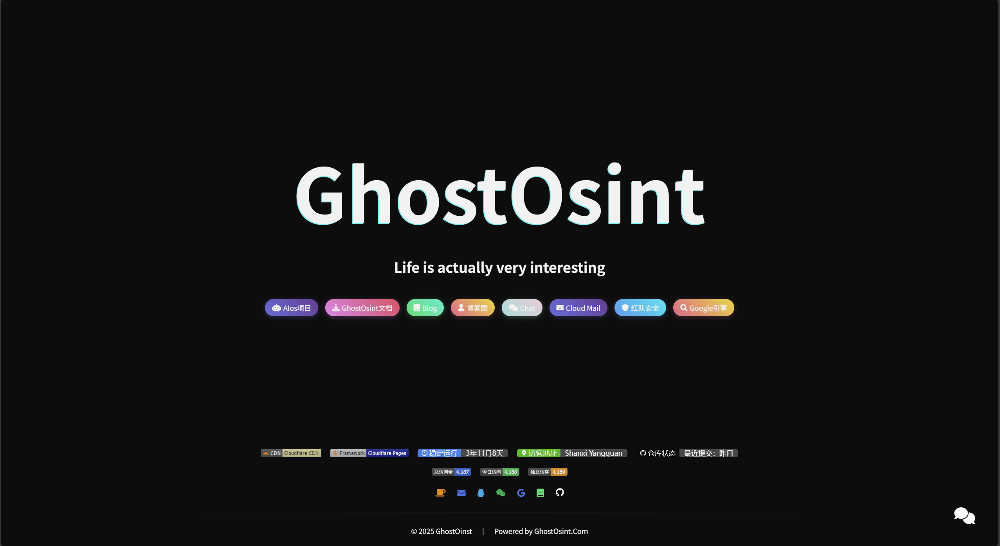

# GhostOsint 多功能AI项目网站更新记录

## 项目介绍
GhostOsint 是一个集成了多种AI功能和红队工具的综合性平台，致力于提供智能化的工具和服务，同时融合了网络安全红队相关功能，帮助用户解决各种实际问题，让生活、工作和网络安全研究更加便捷有趣。

### 🔗 官方网站
[www.ghostosint.com](https://www.ghostosint.com)

### 📸 网站截图

## 功能特性
- **AI多工具集成**：整合了多种人工智能工具，包括AI写作、图像处理、数据分析等
- **红队工具集成**：融合了多种网络安全红队工具和功能
- **智能交互体验**：提供流畅直观的用户界面，支持多种交互方式
- **实时AI处理**：实现了高效的实时AI计算和数据处理
- **多平台兼容**：完美适配桌面端和移动端设备
- **个性化定制**：支持用户根据需求定制AI功能
- **安全可靠**：采用先进的安全技术，保障用户数据隐私
- **红队安全研究**：提供安全漏洞分析、渗透测试辅助等功能

## 更新记录

### 2025-12-09
- ✨ 新增了AI智能写作功能
- ✨ 集成了图像生成与编辑工具
- 🎨 优化了网站整体视觉设计
- 📱 改进了移动端适配体验
- 🔴 **红队项目功能集成**：
  - 🕵️ **渗透测试辅助**：AI驱动的渗透测试工具集成
  - 🔍 **漏洞扫描**：自动化漏洞检测和分析
  - 🛡️ **安全态势感知**：实时安全监控和分析
  - 📊 **红队行动可视化**：行动过程和结果可视化展示
  - 🔧 **红队工具集**：集成多种常用红队工具
- 🔗 新增了多个功能入口按钮：
  - 🔍 **Alcos扫描**：提供AI驱动的扫描分析功能
  - 👥 **GhostGirl社区**：AI爱好者交流社区入口
  - 📺 **B站**：集成B站内容和功能
  - 📝 **博客园**：博客平台集成
  - ✉️ **Cloud Mail**：AI辅助的邮件服务
  - 🛠️ **EI工具**：多功能AI工具集
  - 🌐 **Google计划**：Google服务集成
- 🔧 修复了已知的小bug

### 2025-12-08
- ✨ 新增了AI数据分析功能
- ✨ 集成了智能聊天助手
- 📊 优化了数据可视化展示
- 🔒 增强了AI模型安全性

### 2025-12-07
- ✨ 网站正式上线
- 🎯 实现了核心AI功能模块
- 📝 添加了AI工具使用文档
- 🔗 集成了第三方AI服务

## 技术栈
- **前端框架**：现代化的前端技术栈，支持流畅的AI交互
- **后端服务**：高效的后端处理，支持大规模AI计算
- **AI模型**：集成了多种先进的AI模型和算法
- **数据库**：可靠的数据存储和管理系统
- **云计算**：利用云端资源实现高效AI推理
- **部署**：持续集成和自动化部署

## 贡献指南
欢迎提交 Issue 和 Pull Request 来帮助改进项目！

## 许可证
本项目采用 MIT 许可证。

## 法律约束与责任声明
- 🚨 **合法使用**：本平台集成的红队工具仅用于合法的网络安全研究、授权测试和教育目的
- 📜 **合规要求**：使用本平台的红队功能时，请遵守所在国家和地区的法律法规
- 🤝 **授权测试**：所有渗透测试和漏洞扫描必须获得明确授权
- 📌 **责任自负**：用户需自行承担因不当使用本平台功能而产生的一切法律责任
- ⚠️ **禁止滥用**：严禁将本平台用于任何非法活动或未经授权的测试

---

*Life is actually very interesting* 🌟